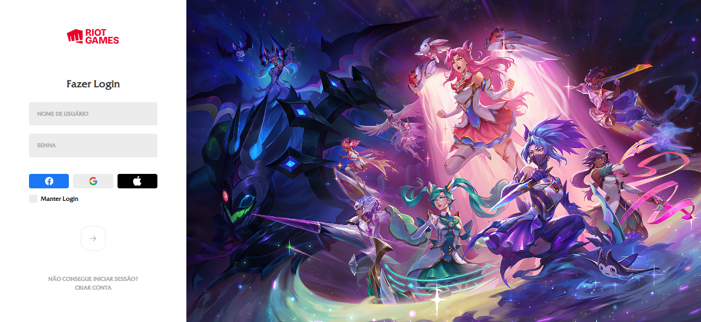
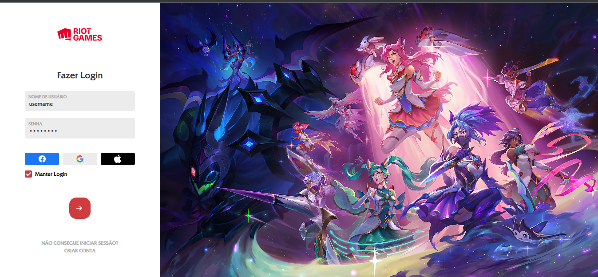

<h1 align = "center"> Hello guys! Welcome to my project. </h1>
 

 This is project of a login screen design inspired by the League of Legends login screen

 

 

The image above represents the login screen without any filling and the image below, the login screen filled with player data. 

 

 
